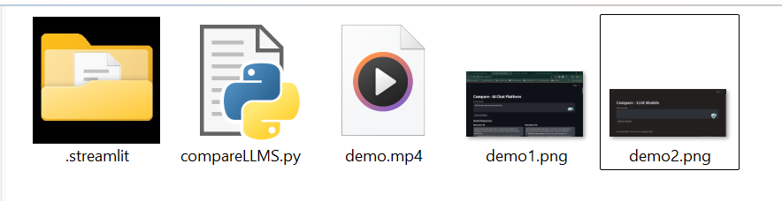

# GROQ-LLM-COMPARE
Compare all LLM's via GROQ api in a single page 

[Watch the video](demo.mp4)

# Build Guide

create a .streamlit folder in your directory 

Add the Files config.toml and secrets.toml inside the .streamlit folder

Add API KEY in your secrets.toml file

