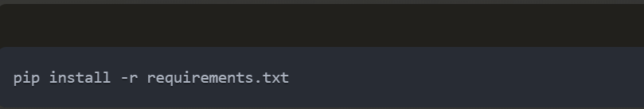
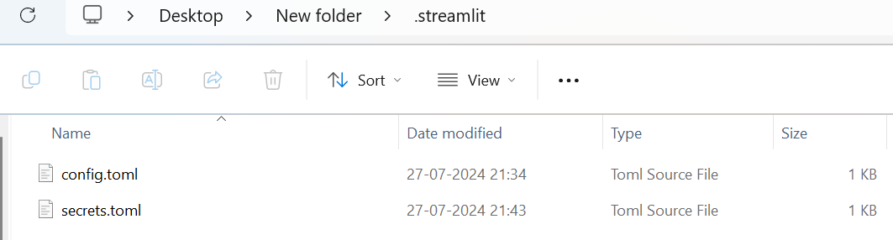
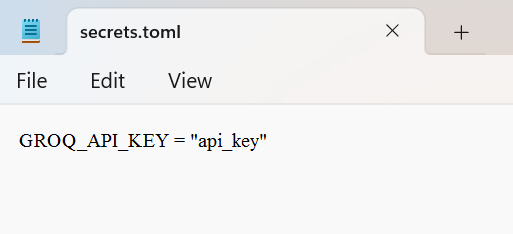

# GROQ-LLM-COMPARE
Compare all LLM's via GROQ api in a single page 

# Video

[# Watch the video](demo.mp4)

# Build Guide

After extracting or downloading the files
create a .streamlit folder in your root directory 

### Install the required libraries

### Add the Files config.toml and secrets.toml inside the .streamlit folder

### Add API KEY in your secrets.toml file

